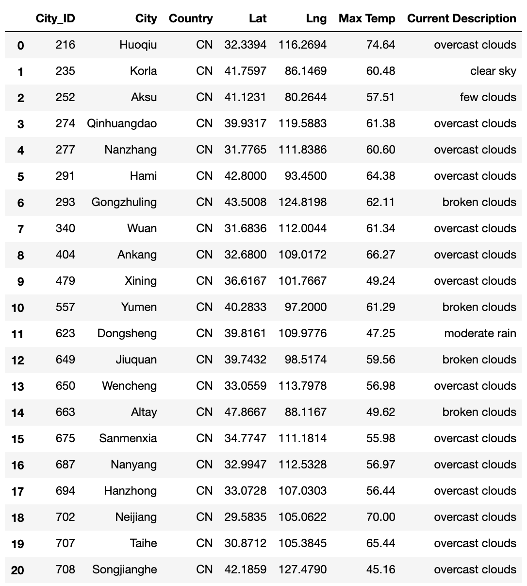
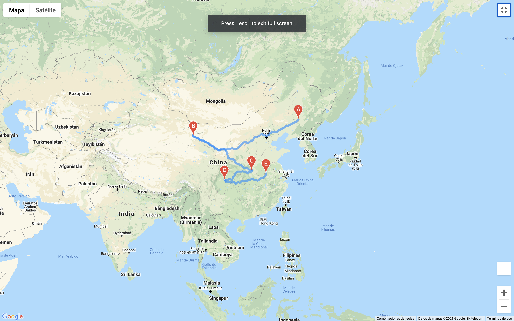
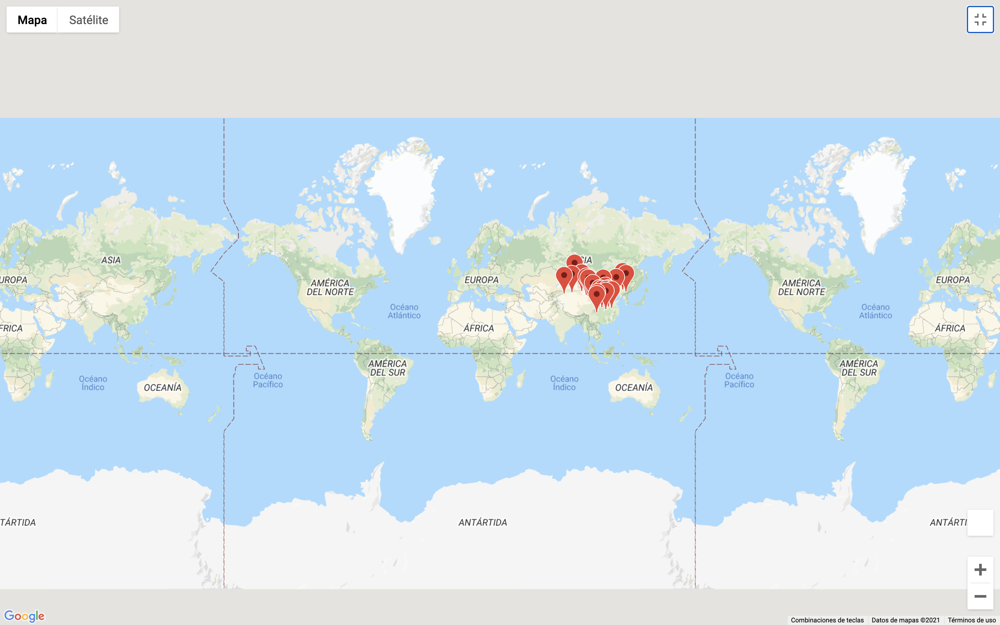

# World Weather Analysis :butterfly:
This project uses Google APIs such as Google Maps, Google Locations and Google Routes to create itineraries where the user feel comfortable to select the cities where want to visit. :earth_asia:

## Project Overview

**Task**: Collect and analyze weather data across cities worldwide.
**Purpose**: PlanMyTrip will use the data to recommend ideal hotels based on clients' weather preferences.
**Method**: Create a Pandas DataFrame with 500 or more of the world's unique cities and their weather data in real time. This process will entail collecting, analyzing, and visualizing the data.

## Resources

- Retrieve and use data from an API "get" request to a server.
- Retrieve and store values from a JSON array.
- Use `try` and `except` blocks to resolve errors.
- Write Python functions.
- Create scatter plots using the Matplotlib library, and apply styles and features to a plot.
- Perform linear regression, and add regression lines to scatter plots.
- Create heatmaps, and add markers using the Google Maps API

## Analysis and Challenges
Handeling graph's scripts and statements that help to identify different variables that helps to create a visualization and make the ability to read JSON files.

## Summary
### TRIP TO CHINA ### :cn:

Cities that satisfied the parameters of:
-_Latitude and longitude
-_Maximum temperature
-_Percent humidity
-_Percent cloudiness
-_Wind speed
-_Weather description (for example, clouds, fog, light rain, clear sky)

Conclusions using API Google Maps

Selected cities in CHINA 

